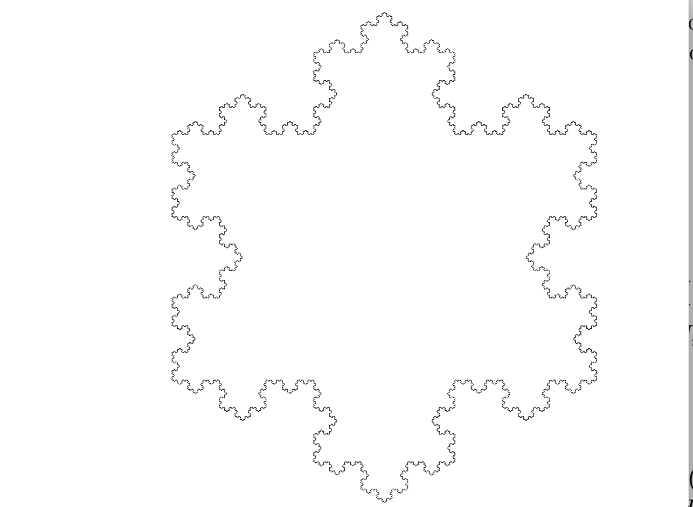

# go-OGLL
A golang-based lindenmayer system implementation WIP

## Manual

### Moving the scene

Use `WASD` to move around. Use `Q` and `E` to zoom.

## Basic Example: Koch' Snowflake

```
-> F=mov(1)
-> L=rot(60)
-> R=rot(-60)
-> F->FLFRRFLF
-> render(FRRFRRF,9)
```


## More advanced and colored: Dragon Curve

